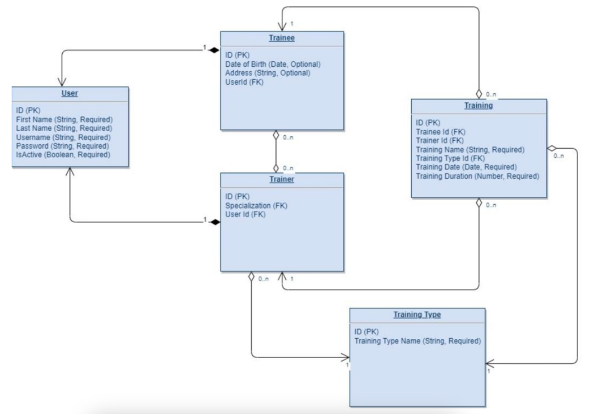

# Gym CRM Application

This is a Gym Customer Relationship Management (CRM) application. It is a console-based application that allows you to
manage trainees, trainers, and training sessions in a gym environment.

## Features

- Manage Trainees: Create, update, delete, and view trainee profiles.
- Manage Trainers: Create, update, and view trainer profiles.
- Manage Trainings: Create and view trainings.

## Execution

You can download the JAR file for this project from the "Releases" section on the GitHub repository page. Please ensure
to download the latest release for the most up-to-date version of the application. After downloading, you can run the
JAR file using the java -jar command in your terminal or command prompt.

```bash
java -jar gym-crm-0.0.1-SNAPSHOT.jar
```

> Note: You need to have Java installed on your system to run the application.

## User Accounts
Below is a list of predefined user accounts grouped by their roles for testing purposes.

### Trainers

| First Name | Last Name | Username     | Password    |
|------------|-----------|--------------|-------------|
| Carlos     | Gomez     | carlos.gomez | password123 |
| Ana        | Martinez  | ana.martinez | password123 |
| Luis       | Perez     | luis.perez   | password123 |

### Trainees

| First Name | Last Name | Username        | Password    |
|------------|-----------|-----------------|-------------|
| Maria      | Rodriguez | maria.rodriguez | password123 |
| Juan       | Lopez     | juan.lopez      | password123 |
| Sofia      | Garcia    | sofia.garcia    | password123 |


## Technologies

- Java 17
- Spring Framework 6.1.5
- Gradle 7.3.3
- Lombok 8.6
- Jackson 2.17.0
- SLF4J 2.0.13
- Log4j 2.21.1
- Jakarta Validation 3.1.0-M2

## Getting Started

### Prerequisites

- Java 17
- Gradle 7.3.3

### Running the Application

1. Clone the repository to your local machine.
2. Navigate to the project directory.
3. Run the application using Gradle:

```bash
gradle run
```

### Running the Tests

To run the tests, use the following command:

```bash
gradle test
```

## Execution

After building the project, you can run the application using the `java -jar` command. Here's how:

1. Open a terminal window.
2. Navigate to the target directory of the project where the jar file is located.
3. Run the following command:

```bash
java -jar gym-crm-0.0.1-SNAPSHOT.jar
```

> Note:
> Please ensure that the jar file name matches the one generated by your build tool.

## Structure

The application follows a standard layered architecture:

- `domain`: Contains the domain model classes.
- `dao`: Contains the Data Access Object (DAO) classes for interacting with the data storage.
- `service`: Contains the service classes that implement the business logic.
- `facade`: Contains the facade classes that provide a unified interface to the services.
- `ui`: Contains the user interface classes.
- `configuration`: Contains the configuration classes.
- `utils`: Contains utility classes.

---

### Hibernate task
Based on:

a) the attached DB schema:



b) on the codebase created during the previous module implement follow functionality:
1. Create Trainer profile.
2. Create Trainee profile.
3. Trainee username and password matching.
4. Trainer username and password matching.
5. Select Trainer profile by username.
6. Select Trainee profile by username.
7. Trainee password change.
8. Trainer password change.
9. Update trainer profile.
10. Update trainee profile.
11. Activate/De-activate trainee.
12. Activate/De-activate trainer.
13. Delete trainee profile by username.
14. Get Trainee Trainings List by trainee username and criteria (from date, to date, trainer
    name, training type).
15. Get Trainer Trainings List by trainer username and criteria (from date, to date, trainee
    name).
16. Add training.
17. Get trainers list that not assigned on trainee by trainee's username.
18. Update Tranee's trainers list
    
#### Notes:

1. During Create Trainer/Trainee profile username and password should be generated as
   described in previous module.
2. All functions except Create Trainer/Trainee profile. Should be executed only after
   Trainee/Trainer authentication (on this step should be checked username and password
   matching)
3. Pay attention on required field validation before Create/Update action execution.
4. Users Table has parent-child (one to one) relation with Trainer and Trainee tables.
5. Trainees and Trainers have many to many relations.
6. Activate/De-activate Trainee/Trainer profile not idempotent action.
7. Delete Trainee profile is hard deleting action and bring the cascade deletion of relevant
   trainings.
8. Training duration have a number type.
9. Training Date, Trainee Date of Birth have Date type.
10. Training related to Trainee and Trainer by FK.
11. Is Active field in Trainee/Trainer profile has Boolean type.
12. Training Types table include constant list of values and could not be updated from the
    application.
13. Each table has its own PK.
14. Try to imagine what are the reason behind the decision to save Training and Training
    Type tables separately with one-to-many relation.
15. Use transaction management to perform actions in a transaction where it necessary.
16. Configure Hibernate for work with DBMS that you choose.
17. Cover code with unit tests. Code should contain proper logging.