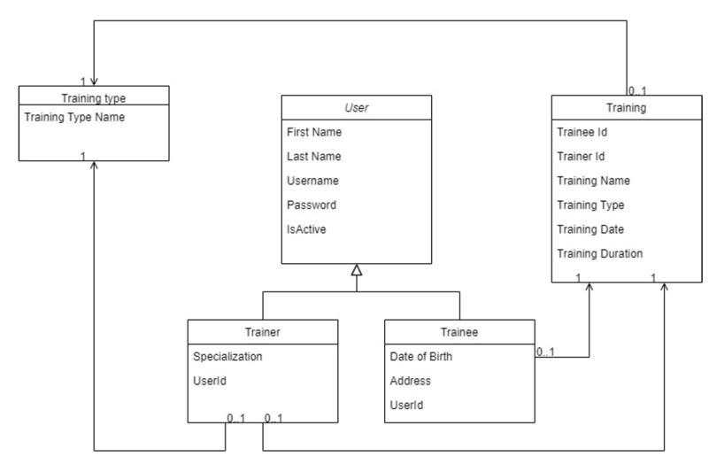

This file contains the task description for the Spring Core task in the Gym CRM Application project.
The first commit _create project_ (70b912f653b2db5fade981ad2e168f6b108be68b) resolves the task.

#### Spring core task

Create a Spring-based module, which handles gym CRM system.
Based on follow objects description:

1. Implement three service classes Trainee Service, Trainer Service, Training Service
2. Trainee Service class should support possibility to create/update/delete/select Trainee
   profile.
3. Trainer Service class should support possibility to create/update/select Trainer profile.
4. Training Service class should support possibility to create/select Training profile.

Notes:

1. [x] Configure spring application context based on the Spring annotation or on Java based
   approach.
2. [x] Implement DAO objects for each of the domain model entities (Trainer, Trainee,
   Training). They should store in and retrieve data from a common in-memory storage -
   java map. Each entity should be stored under a separate namespace, so you could list
   particular entity types.
3. [x] Storage should be implemented as a separate spring bean. Implement the ability to
   initialize storage with some prepared data from the file during the application start (use
   spring bean post-processing features). Path to the concrete file should be set using
   property placeholder and external property file. In other words, Every storage
   (`java.util.Map`) should be implemented as a separate spring bean.
   (Partially implemented, only `Trainee` and `Trainer` storage is implemented)

4. DAO with storage bean should be inserted into services beans using auto wiring. Services
   beans should be injected into the facade using constructor-based injections. The rest of
   the injections should be done in a setter-based way.
5. Cover code with unit tests.
6. Code should contain proper logging.
7. For Trainee and Trainer create profile functionality implement username and password
   calculation by follow rules:
    - [x] Username going to be calculated from Trainer/Trainee first name and last name
      by concatenation by using dot as a separator (eg. John.Smith)
    - [x] In the case that already exists Trainer or Trainee with the same pair of first and
      last name as a suffix to the username should be added a serial number.
    - [x] Password should be generated as a random 10 chars length string.